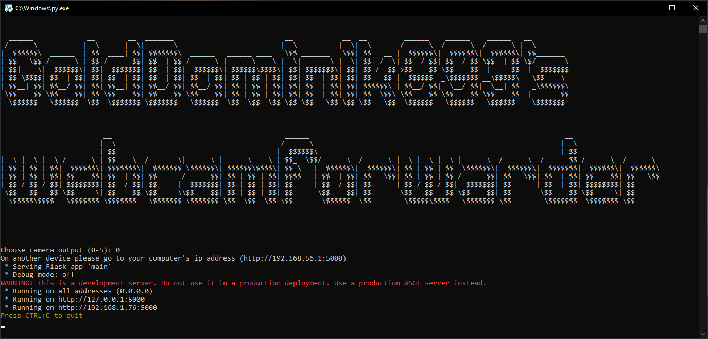

   

A basic python program that lets you stream your computers webcam to your other devices on your network. Requires port forwarding to access from the internet. Uses flask and opencv. 

## Screenshots

## Dependancies
 **Flask** - `pip install Flask` 
 **Opencv** - `pip install opencv` 
 **Socket** - `pip install socket` 
 

## How to use
Download the zip from [here](https://github.com/GoldDominik893/webcamforwarder/archive/refs/heads/main.zip) and extract, then open main.py and navigate to the url provided on a different device on your network and your ready to go. 
If you want to access your webcam from the internet you have to port forward which the instructions for can be found [here](https://portforward.com/).